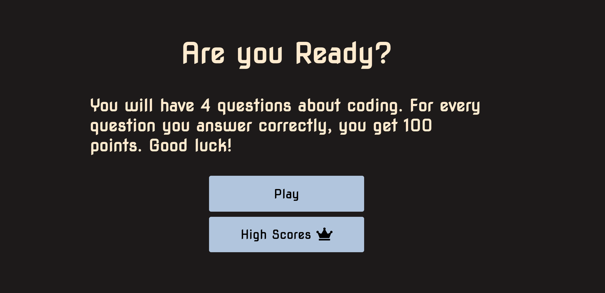
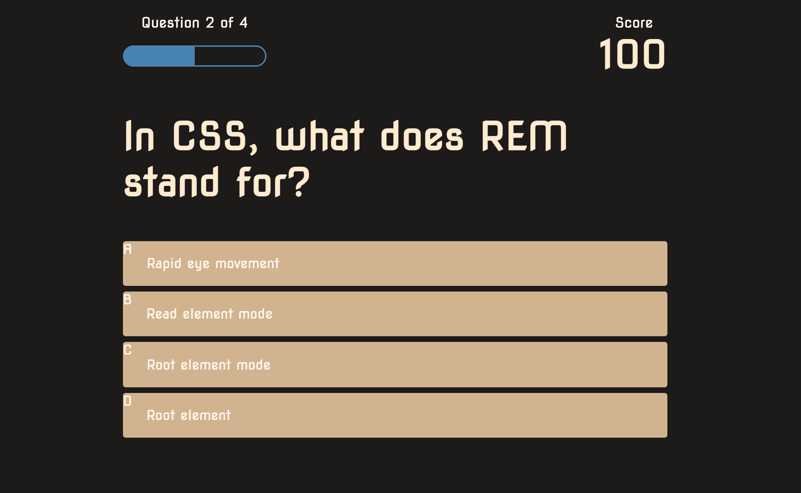
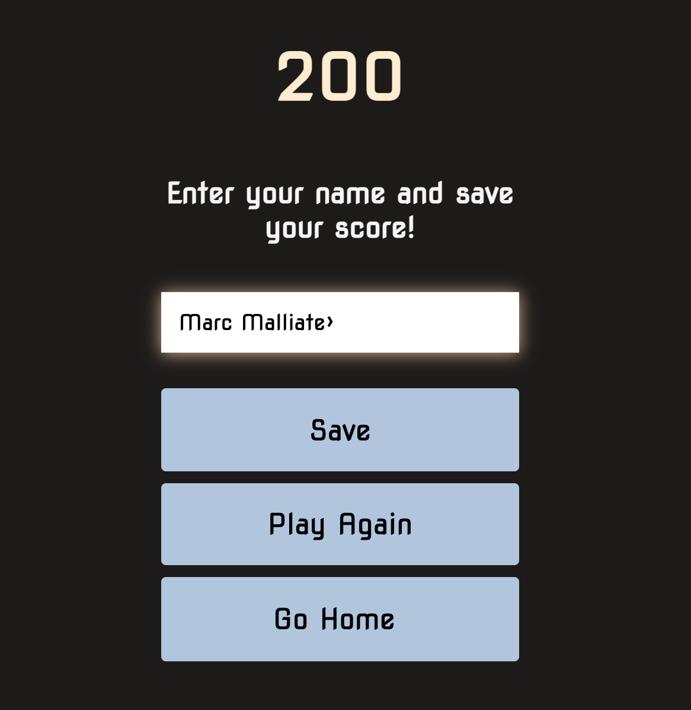

# Quiz-Code

## About this assignment

This website has been designed to run a quiz about coding. It has been built using HTML, Css and Javascript. It includes the following functions:
1. A home page that explains how the game will work and the option to play the game or view the highscores.
2. A game page when multiple choice questions are displayed and and answers are responsive. If the correct answer is chosen the button changes colour to green and 100 points are added to the score. If the answer is wrong the button turns red.
3. Once the quiz is finished, you score is shwn and you are prompted to put in your name and save it to the leaderboard.
4. You can then view the highscores, play the game again or return the home page.

### Issues I had

My biggest issue was adding the timer. I spend hours on this and eventually just deleted it because I was causing too many errors in my code. My goal is to add a timer to my next quiz.

My second issue is a small one. There is a random button on the highscores page that I couldn't find how to remove.

This application has been deployed at a live URL which you can see here: 
https://marcmalliate.github.io/Password-Generator/

You may also like to view the GitHub repository which contains the code repository: 
https://github.com/marcmalliate/Password-Generator

### Screenshots of application:

© 2021 Marc Malliate